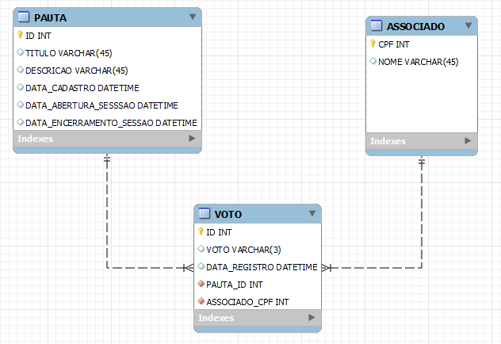

# API de Votação
Um projeto de API de votação de pautas, desenvolvido em Java, para resolução de um Desafio Técnico de Backend.

### Objetivo / Cenário
"No cooperativismo, cada associado possui um voto e as decisões são tomadas em assembleias, por votação. A partir disso, você precisa criar uma solução back-end para gerenciar essas sessões de votação. Essa solução deve ser executada na nuvem e promover as seguintes funcionalidades através de uma API REST:

Cadastrar uma nova pauta;
Abrir uma sessão de votação em uma pauta (a sessão de votação deve ficar aberta por um tempo determinado na chamada de abertura ou 1 minuto por default);
Receber votos dos associados em pautas (os votos são apenas 'Sim'/'Não'. Cada associado é identificado por um id único e pode votar apenas uma vez por pauta);
Contabilizar os votos e dar o resultado da votação na pauta.

Para fins de exercício, a segurança das interfaces pode ser abstraída e qualquer chamada para as interfaces pode ser considerada como autorizada. A escolha da linguagem, frameworks e bibliotecas é livre (desde que não infrinja direitos de uso).

É importante que as pautas e os votos sejam persistidos e que não sejam perdidos com o restart da aplicação."

## Solução
### Principais Tecnologias e recursos utilizados
* Java 11
* Spring Boot
* JPA + Hibernate
* Maven
* JUnit
* Lombok
* Hiroku + PosgreSQL
* Postman  
* GitHub

## Motivação para escolha das Tecnologias
Como se trata de um projeto de pequeno porte, tais tecnologias foram selecionadas de forma a aproveitar bem as facilidades que são propostas para atender as demandas de qualidade e simplicidade de design da solução e com 0 de investimento.

Visando a agilidade para executar a aplicação, a linguagem adotada foi o Java com as ferramentas Spring Boot, Maven e JUnit, o que automatiza todo o processo de preparação do ambiente, deploy e checagem de testes automatizados. Desde que a IDE esteja configurada corretamente, através do comando 'mvn clean install', todas as dependências serão baixadas e instaladas no projeto automaticamente, abrindo mão de procedimentos de configuração manuais.

Além disso, o projeto conta com a API e base de dados remota, a qual foi disponibilizado em nuvem através dos serviços do Hiroku com o PostgreSQL, o que proporcionou também uma melhor agilidade desde a sua primeira utilização, não sendo necessário baixar e muitos menos configurar nenhum banco local para a sua exploração.

O JPA, Hibernate e Lombok foram escolhidos por conta da gama de abstração de código disponibilizada para um desenvolvimento de services usando boas práticas, reduzindo a verbosidade e facilitando a manutenibilidade e legibilidade do código.

Foi utilizado o Postman durante todo o processo de desenvolvimento para fins de testes de end-point e o GitHub como repositório e versionamento do código, por ser conhecido e de fácil uso.

## Modelo de Dados


## Service
Para facilitar a visualização e testes imediatos, poderão ser utilizados os end-points do Heroku.
> BASE_URL: https://yd-test-votacao-api.herokuapp.com/api/v1

Obs: Para uso local, basta substituir o BASE_URL por http://localhost:8080/api/v1

#### Gestão de Associados 
* Listar Associados - [GET] /associado

Retorno esperado:


  
* Cadastrar Associado - [POST] /associado

Exemplo do Body para Cadastro:
```JSON
  {
  "cpf": "61577282302",
  "nome": "Fulano"
  }
````
Retorno esperado:
> "Foi criado o Associado com o CPF { cpf }"

Exceção 1: CPF existente
> "Já existe um associado com o CPF { cpf }"

#### Gestão de Pautas
* #### Listar Pautas - [GET] /pauta

Retorno Esperado:


* #### Cadastrar Pauta - [POST] /pauta

Exemplo do Body para Cadastro:

```JSON
{
    "titulo": "Pauta teste 3",
    "descricao": "Esta pauta é para tal coisa"
}
````

* #### Abrir sessão de votos - [PUT] /pauta/{ id_pauta }/sessao/abrir 
  
Exemplo do Body para Abertura de Sessão:

```JSON
{
  "duracao" : 5
}
````
Obs: A Duração é em minutos. Por DEFAULT o valor é 1

Retorno Esperado:
> "Foi iniciada a sessão de votação da Pauta com o ID { id_pauta }"

Exceção 1: Pauta não encontrada
> "Pauta não encontrada com o ID { id_pauta }"

Exceção 2: Período de votação encerrado
> "Já foi encerrada a votação para a Pauta com o ID  { id_pauta }"

Exceção 3: Período de votação já aberto
> "Já existe uma votação em aberto para a Pauta com o ID  { id_pauta }"


* #### Efetuar voto - [POST] /pauta/votar

Exemplo do Body para efetivação do voto:

```JSON
{
  "idPauta": "3",
  "cpfAssociado": "61577282302",
  "voto": true
}
````

Retorno Esperado:
> "Voto registrado com sucesso na Pauta com ID { id_pauta }"

Exceção 1: CPF inválido
> "O seguinte CPF é inválido: { cpf }"
Obs: A validação é feita a partir de uma integração com a API externa sugerida (https://user-info.herokuapp.com/users/{cpf})

Exceção 2: Pauta não encontrada
> "Pauta não encontrada com o ID { id_pauta }"

Exceção 3: Período de votação encerrado
> "Já foi encerrada a votação para a Pauta com o ID { id_pauta }"

Exceção 4: Período de votação ainda não iniciado
> "Ainda não foi aberta a votação para a Pauta com o ID { id_pauta }"

Exceção 5: Voto já efetuado pelo Associado
> "Foi encontrado pelo menos um voto nesta Pauta pelo associado com o CPF { cpf }"
